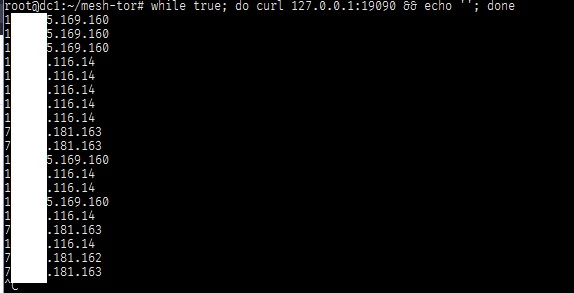

<pre>Mesh tor proxy that scales

docker-compose up --build
docker-compose scale tor=10

// docker-compose down

// You could change the domain destination on the docker-compose.yml at front-server environment
// I personally used this as Rate limit bypass
</pre>

